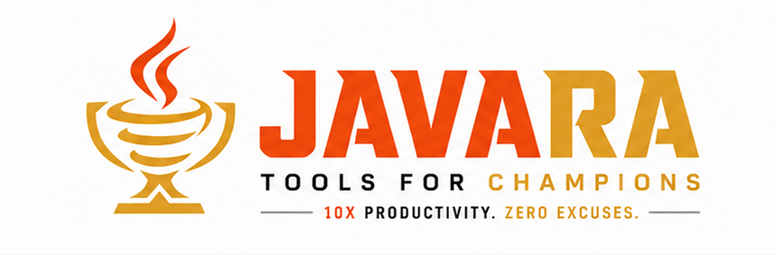

<picture>
  <source media="(prefers-color-scheme: dark)" srcset="assets/01_BANNER_DARK.png">
  <source media="(prefers-color-scheme: light)" srcset="assets/02_BANNER_LIGHT.png">
  
</picture>

<p align="center">
  <picture>
    <source media="(prefers-color-scheme: dark)" srcset="assets/03_ICON_DARK.png">
    <source media="(prefers-color-scheme: light)" srcset="assets/04_ICON_LIGHT.png">
    
  </picture>
</p>

<p align="center">
  <a href="README.id.md">
    
  </a>
</p>

<h1 align="center">JAVARA</h1>
<p align="center"><em>Build Like a Champion.</em></p>

---

**JAVARA** is the championship toolkit for Java engineers. CLI-first productivity tools, scaffolding, and enterprise utilities that turn the Java ecosystem into a high-speed delivery platform.

> The full product direction and brand philosophy is available in [docs/PRD.md](docs/PRD.md).

## Philosophy

JAVARA is not a toy framework. It is a **developer arsenal** for backend engineers who are serious about speed, reliability, automation, and delivery quality.

Java is not just a language — it is the competitive arena of the enterprise. JAVARA is the weapon you bring to win that arena.

## What JAVARA Provides

- **Project Scaffolding** — bootstrap clean architecture, DDD, multi-module Spring Boot projects in seconds
- **Enterprise Utilities** — DTO mapper generator, repository generator, OpenAPI client generator, RBAC scaffolding
- **Build Acceleration** — Maven/Gradle enhancement, dependency optimizer, starter packs, CI presets
- **Developer Experience** — reduce boilerplate, eliminate repetitive setup, and stay in flow

```bash
javara new payment-service
javara add kafka
javara add auth-jwt
```

## Roadmap

| Phase | Focus |
|-------|-------|
| Phase 1 | Java utilities & scaffolding CLI |
| Phase 2 | Developer platform — templates, generators, plugins, AI-assisted refactor |
| Phase 3 | Acceleration platform — "JetBrains + Vercel for the Java ecosystem" |

## Brand

JAVARA = **Java** + **Jawara** (champion in Indonesian).

> Not just Java tools. An identity for Java engineers who play to win.

**Archetypes:** Warrior · Engineer · Champion

## License

MIT © 2026 Faisal Affan — see [LICENSE](LICENSE).

---

<p align="center">
  <sub>Java Wins Here.</sub>
</p>
